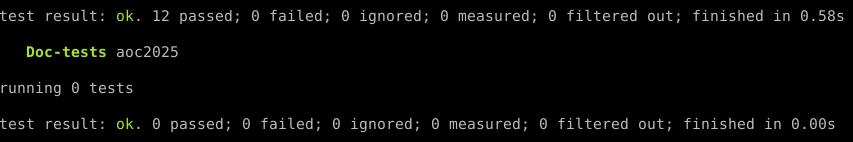
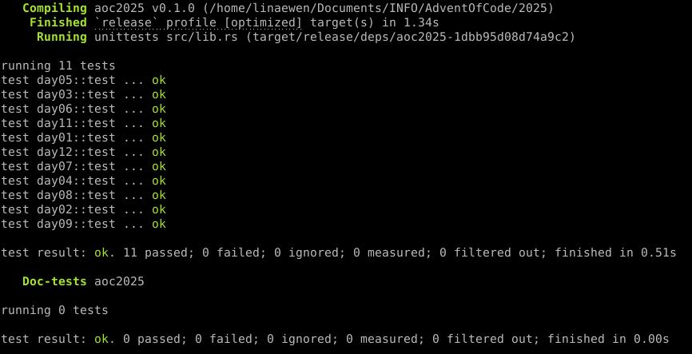

# 🎄 Advent of Code 2025 🎄

This repository contains my solutions to [Advent of Code 2025](https://adventofcode.com/2025), a series of daily programming puzzles published in December 2015.

## ✨ About

Each day consists of two related puzzles that require problem-solving, algorithmic thinking, and some creative coding.  
This project is written in **Rust**, mainly for learning and fun.  
I plan to do some puzzles also in **Python** and then compare how fast they are.

## 📦 Requirements

- [Rust](https://www.rust-lang.org/tools/install)

## 🧠 Structure

- Each puzzle is implemented in its own module under `src/`.
- The corresponding data files are in `inputs/`, but I don't publish them here like [required by the author](https://adventofcode.com/2025/about) (these are my inputs, they are generated differently for each user when logged into AdventOfCode so yours are different, you can't use my results directly).
- Please note that for some days, I might have applied a change to the input file:
    - In day 02, I deleted the final line break.

### Debug mode
Compile and run **all** with:
```bash
cargo test
```

Compile and run **a specific day XX** with:
```bash
cargo test -- dayXX
```

Compile and run **a specific day XX** and **print logs** with:
```bash
cargo test -- --nocapture dayXX
```

### Release mode (faster run)
Compile and run **all** with:
```bash
cargo test --release
```

Compile and run **a specific day XX** with:
```bash
cargo test --release -- dayXX
```

Compile and run **a specific day XX** and **print logs** with:
```bash
cargo test --release -- --nocapture dayXX
```

## 🚧 Status

All problems solved! 🎯 (But I might refactor some problems later.)

Final progress:  
⭐⭐⭐⭐⭐⭐⭐⭐⭐⭐⭐⭐   
⭐⭐⭐⭐⭐⭐⭐⭐⭐⭐⭐⭐   
**24 / 24 stars — Advent of Code 2025 completed! 🚀**

According to my personnal stats, I've spent a total of **18h 19min** on AOC 2025 so approximately **1h 32min by day**.

## ⚡ Performance

Here is a screenshot from my terminal showing the total runtime for all 12 days (compiled in release mode) on my machine, the full solutions for all 12 days execute in about **0.58 seconds**:




And here is the screenshot excluding day 10 because the solver creates to many prints that cannot be easily silenced):

